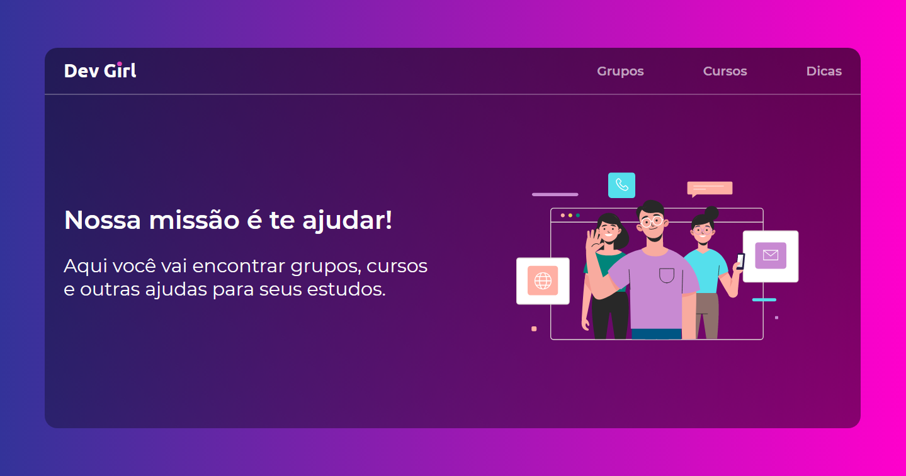

## Dev Girl


  
## Descrição
Essa parte do projeto é para criar algo parecido com uma rede social. A ideia é algo parecido com o twitter. O usuário pode escrever textos e postar, e outros podem interagir, curtir e compartilhar.

## 💻📱 Preview
<a href="https://www.figma.com/file/VEWWgnaV9TYCmtdwcN4SJ0/Devgirl?node-id=0%3A1">Acesse o layout do figma</a>


## 🔨 Tecnologias a serem utilizadas
- React.js e styled components.


## ⚙️ Executando o projeto 

Execute os comandos no seu terminal:

```bash
# Clone o repositório
$ git clone https://github.com/SamGCM/devgirl.git

# Entre no diretório
$ cd devgirl
$ cd devgirl-app

# Instale as dependências
$ npm install

# Inicie com
$ yarn start
```

## 🤔 Como contribuir

- Faça um fork desse repositório;
- Cria uma branch com a sua feature: `git checkout -b minha-feature`;
- Faça commit das suas alterações: `git commit -m 'feat: Minha nova feature'`;
- Faça push para a sua branch: `git push origin minha-feature`.

Depois que o merge da sua pull request for feito, você pode deletar a sua branch.

[](https://www.linkedin.com/in/samuel-gama-222a26188)
